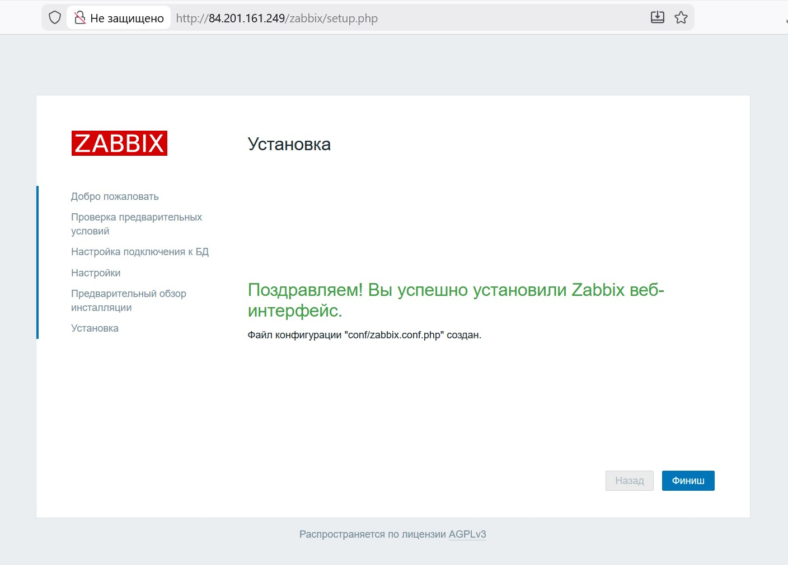
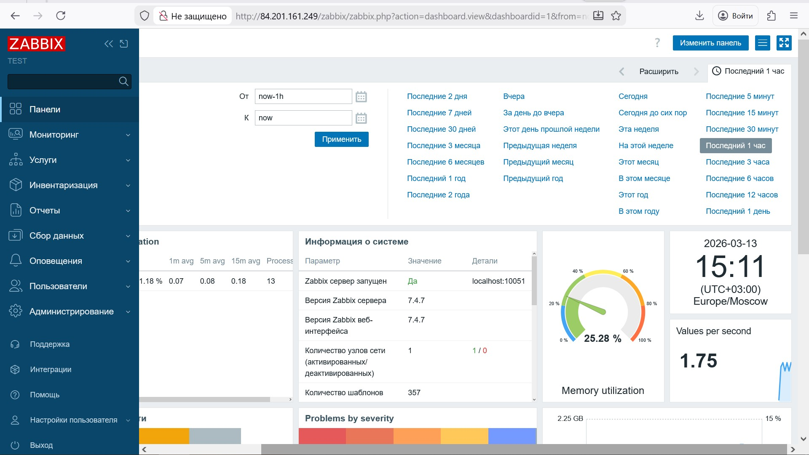
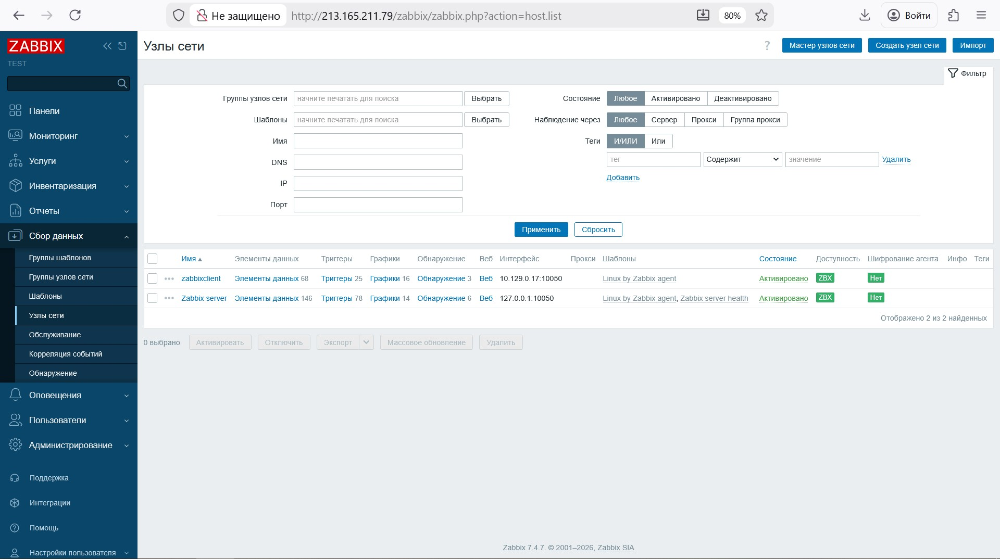
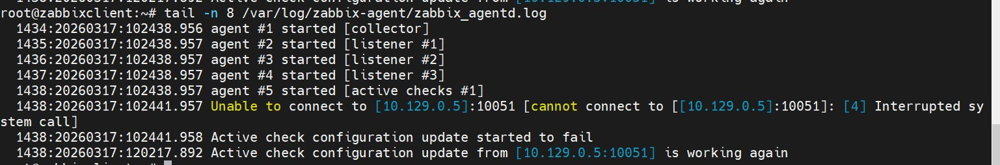
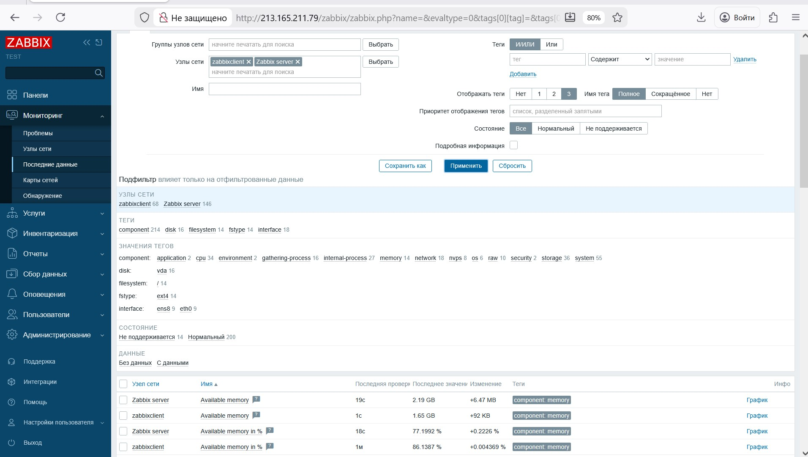
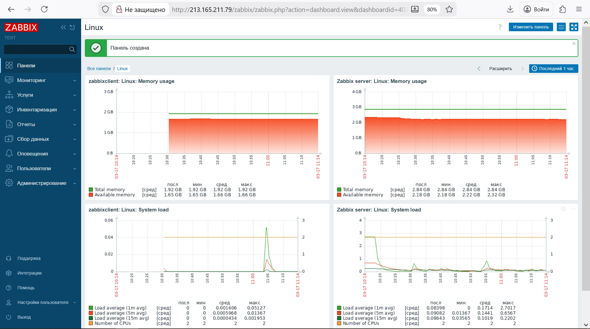

# Домашнее задание к занятию "Система мониторинга Zabbix" - 'Бобков Алекандр'

Задание 1
Установите Zabbix Server с веб-интерфейсом.
Процесс выполнения

    Выполняя ДЗ, сверяйтесь с процессом отражённым в записи лекции.
    Установите PostgreSQL. Для установки достаточна та версия, что есть в системном репозитороии Debian 11.
    Пользуясь конфигуратором команд с официального сайта, составьте набор команд для установки последней версии Zabbix с поддержкой PostgreSQL и Apache.
    Выполните все необходимые команды для установки Zabbix Server и Zabbix Web Server.

Требования к результатам

    Прикрепите в файл README.md скриншот авторизации в админке.
    Приложите в файл README.md текст использованных команд в GitHub.

ОТВЕТ:

Используемые команды:

a. Установите репозиторий Zabbix:

wget https://repo.zabbix.com/zabbix/7.4/release/debian/pool/main/z/zabbix-release/zabbix-release_latest_7.4+debian12_all.deb
dpkg -i zabbix-release_latest_7.4+debian12_all.deb
apt update 

б. Установите Zabbix сервер, веб-интерфейс и агент
apt install zabbix-server-pgsql zabbix-frontend-php php8.2-pgsql zabbix-apache-conf zabbix-sql-scripts zabbix-agent

в. Установка postgresql

sudo apt install postgresql postgresql-contrib

г. Создайте базу данных

Установите и запустите сервер базы данных.

Выполните следующие комманды на хосте, где будет распологаться база данных.
# sudo -u postgres createuser --pwprompt zabbix
# sudo -u postgres createdb -O zabbix zabbix

На хосте Zabbix сервера импортируйте начальную схему и данные. Вам будет предложено ввести недавно созданный пароль.
# zcat /usr/share/zabbix/sql-scripts/postgresql/server.sql.gz | sudo -u zabbix psql zabbix 

д. Настройте базу данных для Zabbix сервера

Отредактируйте файл /etc/zabbix/zabbix_server.conf
DBPassword=password  #(ввести свой пароль)

 
e. Запустите процессы Zabbix сервера и агента

Запустите процессы Zabbix сервера и агента и настройте их запуск при загрузке ОС.
# systemctl restart zabbix-server zabbix-agent apache2
# systemctl enable zabbix-server zabbix-agent apache2 

Открыть страницу с zabbix http://host/zabbix 

################################################################################################

Задание 2

Установите Zabbix Agent на два хоста.
Процесс выполнения

    Выполняя ДЗ, сверяйтесь с процессом отражённым в записи лекции.
    Установите Zabbix Agent на 2 вирт.машины, одной из них может быть ваш Zabbix Server.
    Добавьте Zabbix Server в список разрешенных серверов ваших Zabbix Agentов.
    Добавьте Zabbix Agentов в раздел Configuration > Hosts вашего Zabbix Servera.
    Проверьте, что в разделе Latest Data начали появляться данные с добавленных агентов.

Требования к результатам

    Приложите в файл README.md скриншот раздела Configuration > Hosts, где видно, что агенты подключены к серверу
    Приложите в файл README.md скриншот лога zabbix agent, где видно, что он работает с сервером
    Приложите в файл README.md скриншот раздела Monitoring > Latest data для обоих хостов, где видны поступающие от агентов данные.
    Приложите в файл README.md текст использованных команд в GitHub

ОТВЕТ:

   Cкриншот раздела Configuration > Hosts:

   

   Cкриншот лога zabbix agent:	

   
   
   Cкриншот раздела Monitoring > Latest data:

   
 
   Покажу еше панели (не стал менять ip для агента установленного на самом сервере zabbix):

   

   Текст использованных команд
